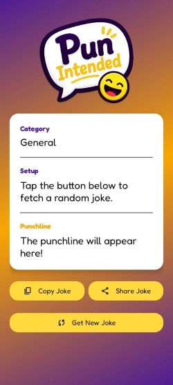
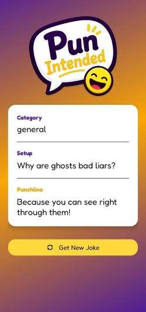
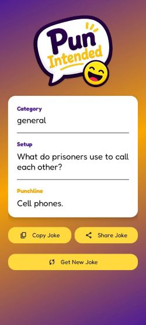
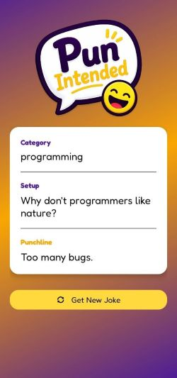

# 😂 Pun Intended

A simple Android application that fetches and displays random jokes using the Random Joke API. Built using XML, Java, and the Volley library, this project demonstrates API integration and JSON data parsing using Volley library in Android development.

---

## 🚀 Key Features

- Fetches random jokes from an online REST API
- One-tap joke generation
- Fast API requests using Volley
- JSON response parsing
- Simple and clean XML-based UI
- Beginner-friendly Android project

---

## 🧑‍💻 Tech Stack

- Java
- XML
- Android Studio
- Volley
- REST API
- JSON

---

## 📁 Project Structure
```text
app/
├── java/
│   └── com.example.PunIntended/
│       └── MainActivity.java
├── res/
│   ├── layout/
│   │   └── activity_main.xml
│   ├── values/
│   ├── font/
│   └── drawable/
├── AndroidManifest.xml
└── Gradle Scripts/
```
---

## 📷 Screenshots

| Home Screen                      | Joke1                             | Joke2                             | Joke3                             |
|----------------------------------|-----------------------------------|-----------------------------------|-----------------------------------|
|  |  |  |  |

---

## 📖 What I Learned

While building this project, I gained experience with:

- Making API requests and fetching data from a remote REST API.
- Using Volley for efficient network communication in Android.
- Handling asynchronous API responses and updating the UI dynamically.
- Parsing JSON responses received from the API.
- Handling network errors and displaying appropriate error messages.
- Designing a simple and user-friendly interface using XML layouts.
- Handling button clicks and triggering API calls based on user interaction.

---

<div align="center">


</div>

---